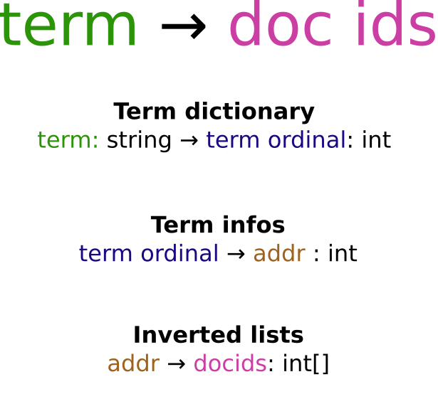
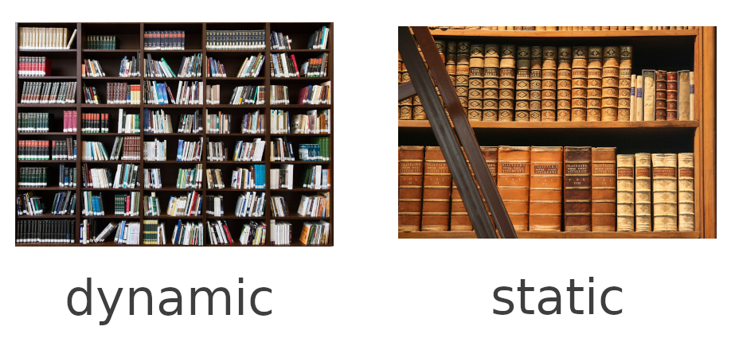
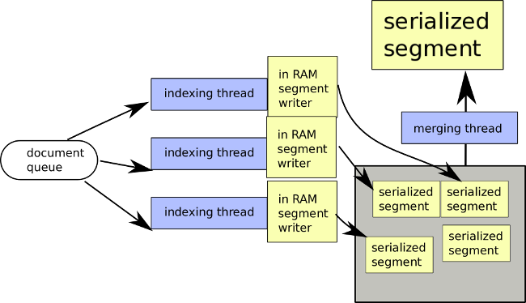
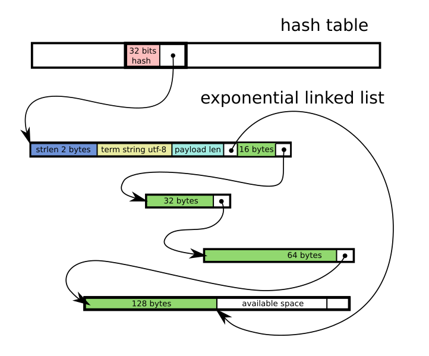
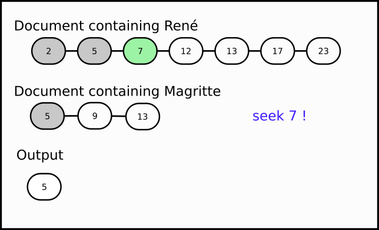
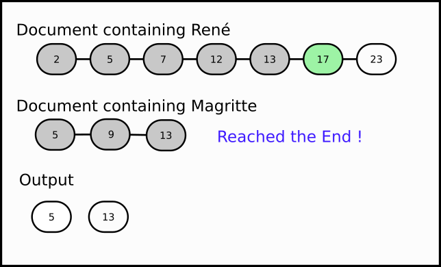
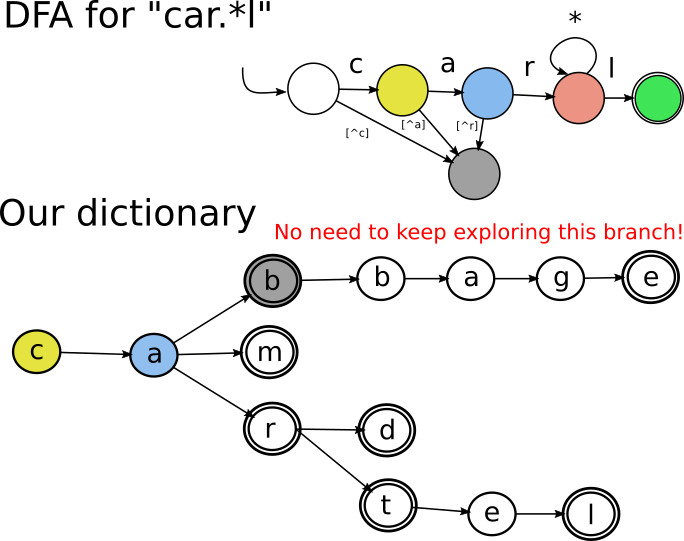
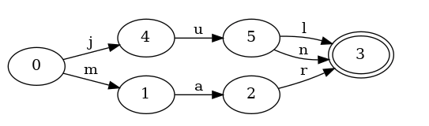
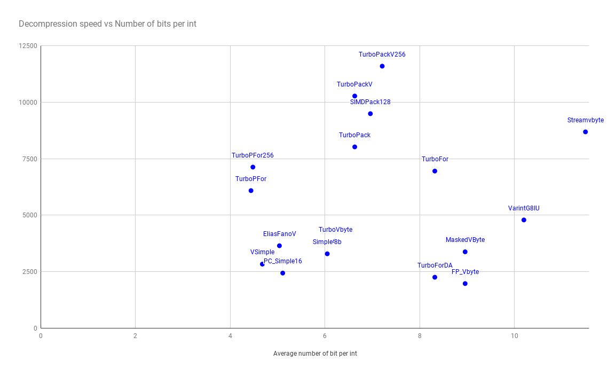

class: title, center, middle


# Deep dive into indexing
##  @fulmicoton (Paul Masurel)
---

# Paul Masurel (aka @fulmicoton)

- French dev living in Japan
- Now software engineer @Google *(but tantivy is unrelated with Google)*
- Tantivy main dev, but overall around 30 contributors

???
Started tantivy to learn rust.
---

# What's tantivy?

- Search engine library 
- Rust
- Linux, MacOS, Windows, ARM, Wasm (?), ...
- Still cute: ~30K Lines of code
- It's fast [Benchmark](https://tantivy-search.github.io/bench/)
- Inspired by Lucene
  
???
inspired by Lucene:
I have very little to work on this project ->
when in doubt copy Lucene.
 
pet project

---
class: title, center, middle

# **Index** efficiently terabytes of data with gigabytes of RAM 

???
This not a marketing presentation...
Applies to Lucene

---

# I indexed 6TB of web pages on my old desktop (8GB) without any problem.

[https://fulmicoton.com/posts/commoncrawl/](https://fulmicoton.com/posts/commoncrawl/)


# Proof ?
---

# French people are ...

<center></center>

---
  
# Japanese people are ...

<center></center>

[https://fulmicoton.com/posts/commoncrawl/](https://fulmicoton.com/posts/commoncrawl/)

---
class: title, center, middle

# What's challenging about it?

---

## What's an Inverted index

**For each term, we have a sorted list of doc ids**

- Magritte → [5, 9, 13]
- René → [2, 5, 7, 12, 13, 17, 23]

---

# Oversimplified data structure

<center></center>

All of these datastructure are as compact as possible and MMapped in memory. 

---
# Problem



How do we build and update such a compact structure?

???
Dynamic structure require some room.
---

# Solution: Logarithmic method

- User allocates a RAM budget (e.g. `100MB`).
- Add documents in a dynamic in-RAM datastructure until we reach this budget.
- When this budget is reached, serialize this batch data in the right format to disk : The result is called a **segment**.

**A segment is a small independent index.**

???


---

# 100 MB

<center></center>
  

---

# 200 MB

<center></center>
  

---

# 300 MB

<center></center>

---

# 400 MB

<center></center>
  

---
# 5GB, too many segments?

<center></center>
  

---

# The trick

Merging N-segments what ever their size, can be done in constant memory.

---

# Merge for the win !

<center></center>

---

# Merge for the win !

<center></center>

---

# Merge for the win !

<center></center>

---

# Second merge

<center></center>

---

# And so on...  

<center></center>


---

# After 5 GB

<center></center>

---

# Parallelization of indexing is trivial




---

class: title, center, middle

# Segment building

---
## Index building (Pseudo code)


**When appending the documents**

```python
inverted_index = defaultdict(list) 
for (doc_id, doc_text) in docs:
  for term in tokenize(doc_text):
    inverted_index[term].append(doc_id);
```


**When serializing the segment**

```python
terms = sorted(inverted_index.keys()) 
for term in terms:
  serializer.serialize(term, inverted_index[term])
```

???
No BTreeMap


---

### Can we do better than

  `HashMap<String, Vec<u8>>` ?

Specs:
  - Append only
  - Write Many Read Once :) 
  - Need to know memory usage accurately
  - Memory efficient regardless of the distribution of term frequencies.

???
  Not `DocId` because we need term freq and position.

    We will forget about term frequency and positions.
    If that bugs you, the `Vec<DocID>` is in fact a writeable buffer.


---

<center></center>
---

# Exponential unrolled linked list?

Blocks grow exponentially  from `16 bytes` to `32KB`, after which we plateau.

- `O(log(n))` blocks for medium size lists
- For medium lists, in average 25% wasted space
- For short lists, 16 bytes per list
- For super long lists, a few % of wasted space
- No copy needed
- No memory deallocation
- Memory Arena with a bump allocator

---

class: title, center, middle

# That's all Folk

## Any questions?

https://gitter.im/tantivy-search/tantivy
paul.masurel@gmail.com


---
----

**Sufficient to compute any boolean query**

???
Most common solution
---

# Intersection: René AND Magritte


---

# Intersection: René AND Magritte


---

# Intersection: René AND Magritte


---

# Intersection: René AND Magritte



---

# Intersection: René AND Magritte



Seeking efficiently is crucial. 
---

# Union: René OR Magritte


---

# Union: René OR Magritte


---

# Union: René OR Magritte


---

# Union: René OR Magritte


---

# Union: René OR Magritte


So on and so forth...

---
class: title, center, middle

# Data layout
---

# Term dictionary


- **`&[u8] → term id`**<br/>
  `term id → TermInfo`


---

# Term dictionary

- Hash maps family ?
  - fast lookups, one or two random IO.

- **Trie** family ?
  - lookup more expensive
  - more random IO (varies depending on the node layout)
  - iterate ranges of sorted keys
  - term id are term ordinal
  - intersection with a DFA (levenshtein, regex)

---

---


---


---


---


---

# Finite state transducer (FST)

Based on the [fst crate](https://github.com/BurntSushi/fst) from [@BurntSushi](https://twitter.com/burntsushi5)

<div style="font-size: 14px;">
<br/>
<a href="https://blog.burntsushi.net/transducers/">BurntSushi's blog</a>
</div>

- More compact than a trie (values are somewhat compressed)
- More CPU intensive
- Same operations as a trie
- Can access `term_ord ⟶ term`.

---
class: title, center, middle

# Postings lists

---
# docIds, TF: Int compression

</img>

<p style="font-size: 15px">
<em>
(figures are taken from <a href="https://github.com/powturbo/TurboPFor">powturbo/TurboPFor</a>'s benchmark)
</em>
</p>

---


# simdpack128

*Daniel Lemire, Leonid Boytsov, Nathan Kurz, SIMD Compression and the Intersection of Sorted Integers, Software Practice & Experience 46 (6), 2016 http://arxiv.org/abs/1401.6399*

[Daniel Lemire's blog](https://lemire.me/blog/)

Reimplemented in Rust [tantivy-search/bitpacking](https://github.com/tantivy-search/bitpacking).

---

# Compressing posting lists using bitpacking 

First, delta encoding :
```
[12, 15, 21, 37, ...] => [12 - 0, 15 - 12, 21 - 15, 37 - 21, ...]
```

Then bitpacking (here we need 5 bits per int32)
```
[12, 3, 6, 11, ...] => 00110 11000 01100 00001...```

We then concatenate these bits.

---


# S4-BP128-D4

- 4 ints at a time
- SIMD delta integration
- blocks of 128 ints
- SSE3
- Fallback implementation if SSE3 not available 
    - at compile time (if the arch is not x86_64)  
    - at runtime (if the CPU is too old)

???
SSE3 widely available
Entirely unrolled

---

unpack 5 bits<br/>
523 instructions, mostly SIMD

```asm
 ...
 lddqu   xmm1, xmmword, ptr, [rdi]
 movapd  xmm0, xmmword, ptr, [rip, +, .LCPI69_0]
 movapd  xmm2, xmm1
 pshufd  xmm3, xmmword, ptr, [rdx], 255
 andpd   xmm2, xmm0
 movapd  xmm4, xmm2
 pslldq  xmm4, 8
 paddd   xmm4, xmm2
 movdqa  xmm2, xmm4
 pslldq  xmm2, 4
 paddd   xmm4, xmm3
 paddd   xmm4, xmm2
 movdqa  xmmword, ptr, [rdx], xmm4
 mov     rax, qword, ptr, [rdx, +, 16]
 movdqu  xmmword, ptr, [rax], xmm4
 mov     rax, qword, ptr, [rdx, +, 16]
 lea     rcx, [rax, +, 16]
 mov     qword, ptr, [rdx, +, 16], rcx
 movapd  xmm2, xmm1
 psrld   xmm2, 5
 ...
 ```


 ---

 # DocIds and DocFreqs are interlaced

 

 ---

 # Skip Info

 
